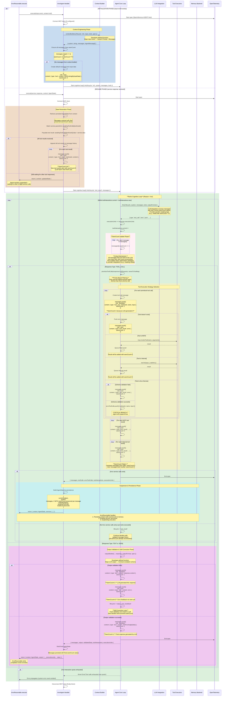

```mermaid
sequenceDiagram
    participant Resumable as ArvoResumable.execute
    participant Agent as ArvoAgent Handler
    participant Context as Context Builder
    participant CoreLoop as Agent Core Loop
    participant LLM as LLM Integration
    participant Tools as Tool Executors
    participant Memory as Memory Backend
    participant Otel as OpenTelemetry

    alt INITIALIZATION PHASE (input event exists)
        Resumable->>Agent: execute(input event, context=null)
        Agent->>Otel: Start span (OpenInference AGENT kind)
        Agent->>Agent: Connect MCP client (if configured)
        
        rect rgb(200, 220, 240)
            Note over Agent,Context: Context Engineering Phase
            Agent->>Context: contextBuilder({ lifecycle: 'init', input, tools, span })
            Note over Context: Developer-defined function:<br/>Maps input event → System Prompt + Messages
            Context-->>Agent: { system: string, messages: AgentMessage[] }
            
            Agent->>Agent: Ensure all messages have seenCount
            Note over Agent: messages.map(m => ({<br/>  ...m,<br/>  seenCount: m.seenCount ?? 0<br/>}))
            
            alt No messages from context builder
                Agent->>Agent: Create default message from input data
                Note over Agent: [{<br/>  role: 'user',<br/>  content: { type: 'text', content: JSON.stringify(inputData) },<br/>  seenCount: 0<br/>}]
            end
        end
        
        Agent->>CoreLoop: Start cognitive loop({ initLifecycle: 'init', system, messages, tools })
    else RESUME PHASE (service response received)
        Resumable->>Agent: execute(service response, context: AgentState)
        Agent->>Otel: Start span
        Agent->>Agent: Connect MCP client
        
        rect rgb(240, 220, 200)
            Note over Agent: State Restoration Phase
            Agent->>Agent: Retrieve persisted AgentState from context
            Note over Agent: Messages restored with their<br/>preserved seenCount values
            
            Agent->>Agent: Match service.parentid to awaitingToolCalls[toolUseId]
            Agent->>Agent: Populate tool result: awaitingToolCalls[toolUseId].data = service.data
            
            alt All tool results received
                Agent->>Agent: Append all tool results to message history
                loop For each tool result
                    Agent->>Agent: messages.push({<br/>  role: 'user',<br/>  content: { type: 'tool_result', toolUseId, content },<br/>  seenCount: 0<br/>})
                    Note over Agent: **SeenCount Init:**<br/>New tool results start with seenCount=0<br/>(LLM hasn't seen them yet)
                end
            else Still waiting for other tool responses
                Agent->>Resumable: return { context: updatedState }
                Note over Resumable: Agent remains suspended—<br/>waiting for other in-flight service calls
            end
        end
        
        Agent->>CoreLoop: Start cognitive loop({ initLifecycle: 'tool_result', messages })
    end
    
    rect rgb(220, 240, 220)
        Note over CoreLoop,LLM: **ReAct Cognitive Loop** (Reason + Act)
        
        loop While toolInteractions.current < toolInteractions.max
            CoreLoop->>LLM: llm({ lifecycle, system, messages, tools, outputFormat })
            Note over LLM: LLM Integration receives messages<br/>with their current seenCount values.<br/>Provider-specific masking logic<br/>(e.g., media with seenCount > 0)
            
            LLM-->>CoreLoop: { type: 'tool_call' | 'text' | 'json', ... }
            
            CoreLoop->>CoreLoop: executionUnits += response.executionUnits
            CoreLoop->>CoreLoop: toolInteractions.current++
            
            rect rgb(255, 240, 245)
                Note over CoreLoop: **SeenCount Update Phase**
                
                loop For each message in messages
                    CoreLoop->>CoreLoop: messages[i].seenCount += 1
                end
                
                Note over CoreLoop: **Critical Mechanism:**<br/>All messages that just went to the LLM<br/>now have their view count incremented.<br/>This enables token optimization strategies<br/>in provider integrations (e.g., masking media)
            end
            
            alt Response Type: TOOL_CALL
                CoreLoop->>CoreLoop: prioritizeToolCalls(response.toolRequests, nameToToolMap)
                Note over CoreLoop: **Priority-Based Filtering:**<br/>Only execute highest-priority batch,<br/>silently drop lower-priority calls
                
                rect rgb(240, 240, 200)
                    Note over CoreLoop,Tools: Tool Execution Strategy Selection
                    
                    loop For each prioritized tool call
                        CoreLoop->>CoreLoop: Create tool call message
                        Note over CoreLoop: messages.push({<br/>  role: 'assistant',<br/>  content: { type: 'tool_use', toolUseId, name, input },<br/>  seenCount: 1<br/>})<br/><br/>**SeenCount=1 because LLM generated it**
                        
                        alt Tool doesn't exist
                            CoreLoop->>CoreLoop: Push error message
                            Note over CoreLoop: messages.push({<br/>  role: 'user',<br/>  content: { type: 'tool_result', error },<br/>  seenCount: 0<br/>})
                        else Tool is MCP
                            CoreLoop->>Tools: mcp.invokeTool(name, arguments)
                            Tools-->>CoreLoop: result
                            CoreLoop->>CoreLoop: Queue MCP result
                            Note over CoreLoop: Result will be added with seenCount=0
                        else Tool is Internal
                            CoreLoop->>Tools: tool.fn(input, { otelInfo })
                            Tools-->>CoreLoop: result
                            CoreLoop->>CoreLoop: Queue internal result
                            Note over CoreLoop: Result will be added with seenCount=0
                        else Tool is Arvo Service
                            alt Schema validation fails
                                CoreLoop->>CoreLoop: messages.push({<br/>  role: 'user',<br/>  content: { type: 'tool_result', error },<br/>  seenCount: 0<br/>})
                            else Schema validation succeeds
                                CoreLoop->>CoreLoop: arvoToolCalls.push({ toolUseId, name, input })
                                Note over CoreLoop: **CRITICAL BRANCH:**<br/>Agent will suspend here
                            end
                        end
                    end
                    
                    loop For each MCP tool result
                        CoreLoop->>CoreLoop: messages.push({<br/>  role: 'user',<br/>  content: { type: 'tool_result', ... },<br/>  seenCount: 0<br/>})
                    end
                    
                    loop For each Internal tool result
                        CoreLoop->>CoreLoop: messages.push({<br/>  role: 'user',<br/>  content: { type: 'tool_result', ... },<br/>  seenCount: 0<br/>})
                    end
                    
                    Note over CoreLoop: **SeenCount Pattern:**<br/>- Assistant messages (tool calls): seenCount=1<br/>- User messages (tool results): seenCount=0
                end
                
                alt Arvo service calls exist
                    CoreLoop->>Otel: End span
                    CoreLoop-->>Agent: { messages, toolCalls: arvoToolCalls, toolInteractions, executionUnits }
                    
                    rect rgb(200, 240, 240)
                        Note over Agent,Memory: Suspension & Persistence Phase
                        
                        Agent->>Agent: Build AgentState for persistence
                        Note over Agent: {<br/>  currentSubject,<br/>  system,<br/>  messages, // WITH seenCount preserved per message<br/>  toolInteractions,<br/>  awaitingToolCalls,<br/>  totalExecutionUnits<br/>}
                        
                        Agent->>Resumable: return { context: AgentState, services: [...] }
                        Note over Resumable,Memory: ArvoResumable handles:<br/>1. Persisting context (with seenCount) to memory<br/>2. Emitting service call events<br/>3. Suspending execution
                    end
                else No Arvo service calls (only sync tools executed)
                    CoreLoop->>CoreLoop: lifecycle = 'tool_result'
                    Note over CoreLoop: Continue iteration with<br/>updated message history<br/>(all seenCount already incremented)
                end
                
            else Response Type: TEXT or JSON
                rect rgb(240, 200, 240)
                    Note over CoreLoop: Output Validation & Self-Correction Phase
                    
                    CoreLoop->>CoreLoop: outputBuilder({ ...response, outputFormat, span })
                    Note over CoreLoop: Developer-defined function:<br/>Maps LLM output → Contract-compliant schema
                    
                    alt Output validation fails
                        CoreLoop->>CoreLoop: messages.push({<br/>  role: 'assistant',<br/>  content: { type: 'text', content: response.content },<br/>  seenCount: 1<br/>})
                        Note over CoreLoop: **SeenCount=1:** LLM generated this response
                        
                        CoreLoop->>CoreLoop: messages.push({<br/>  role: 'user',<br/>  content: { type: 'text', content: error },<br/>  seenCount: 0<br/>})
                        Note over CoreLoop: **SeenCount=0:** Error feedback not seen yet
                        
                        CoreLoop->>CoreLoop: lifecycle = 'output_error_feedback'
                        Note over CoreLoop: **Self-Correction Loop:**<br/>Feed validation error back to LLM.<br/>Next iteration will increment seenCount
                    else Output validation succeeds
                        CoreLoop->>CoreLoop: messages.push({<br/>  role: 'assistant',<br/>  content: { type: 'text', content: JSON.stringify(data) },<br/>  seenCount: 1<br/>})
                        Note over CoreLoop: **SeenCount=1:** Final response generated by LLM
                        
                        CoreLoop->>Otel: End span
                        CoreLoop-->>Agent: { messages, output: validatedData, toolInteractions, executionUnits }
                        
                        Agent->>Agent: Build final AgentState
                        Note over Agent: Messages persisted with final seenCount values
                        
                        Agent->>Resumable: return { context: AgentState, output: { __executionunits, ...data } }
                        Note over Resumable: ArvoResumable emits<br/>completion event to broker
                    end
                end
            end
        end
        
        alt Tool interaction quota exhausted
            CoreLoop-->>Agent: throw Error('Tool calls exhausted max quota')
            Agent->>Resumable: Error propagates (system error event emitted)
        end
    end
    
    Agent->>Agent: Disconnect MCP client (finally block)
```
