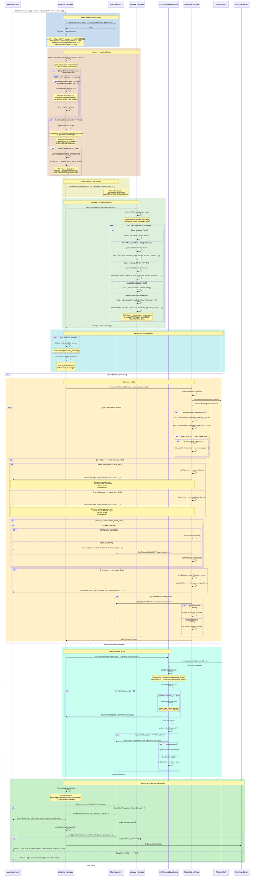

```mermaid
sequenceDiagram
    participant Agent as Agent Core Loop
    participant Integration as Anthropic Integration
    participant Otel as OpenTelemetry
    participant Formatter as Message Formatter
    participant NonStream as Non-Streamable Anthropic
    participant Stream as Streamable Anthropic
    participant Anthropic as Anthropic API
    participant Parser as Response Parser

    Agent->>Integration: llm({ lifecycle, messages, system, tools, outputFormat, onStream })
    
    rect rgb(200, 220, 240)
        Note over Integration,Otel: Observability Setup Phase
        Integration->>Otel: startActiveSpan({ name: 'LLM.invoke<lifecycle>', kind: LLM })
        Otel-->>Integration: span
        
        Integration->>Integration: Configure LLM parameters
        Note over Integration: model = config.model ?? 'claude-sonnet-4-20250514'<br/>max_tokens = config.max_tokens ?? 4096<br/>temperature = config.temperature ?? 0<br/>stream = config.stream ?? true
    end
    
    rect rgb(240, 220, 200)
        Note over Integration,Formatter: Context Processing Phase
        
        Integration->>Integration: await contextTransformer({ messages, system })
        Note over Integration: Uses config.contextTransformer<br/>or defaultContextTransformer
        
        alt Default Context Processing (Media Masking)
            loop For each message in messages
                alt message.content.type === 'media' AND message.seenCount > 0
                    Integration->>Integration: Mask media content to Text
                    Note over Integration: **Token Optimization:**<br/>Replaces parsed media with<br/>placeholder text to save context.
                else
                    Integration->>Integration: Keep original message
                end
            end
        end
        
        alt toolInteractions.exhausted === true
            Integration->>Integration: Inject tool limit prompt
            Note over Integration: 1. messages.push(UserMessage(limitPrompt))<br/>2. system += limitPrompt
            Note over Integration: **Safety Mechanism:**<br/>Forces LLM to stop looping<br/>and provide a final answer.
        end
        
        alt outputFormat.type === 'json'
            Integration->>Integration: Convert Zod schema to JSON schema
            Integration->>Integration: Append JSON schema instruction to system
            Note over Integration: **Structured Outputs:**<br/>Instructs Claude to respond with<br/>valid JSON matching the schema
        end
    end
    
    rect rgb(240, 240, 200)
        Note over Integration,Otel: Input Telemetry Recording
        
        Integration->>Otel: setOpenInferenceInputAttr({ llm, messages, system, tools })
        Note over Otel: Records standard<br/>OpenInference attributes<br/>(input_messages, tool_definitions)
    end
    
    rect rgb(220, 240, 220)
        Note over Integration,Formatter: Message Format Conversion
        
        Integration->>Formatter: formatMessagesForAnthropic(messages)
        
        Formatter->>Formatter: Index Tool Results (create map)
        Note over Formatter: System prompt passed separately<br/>to Anthropic (not in messages array)
        
        loop For each message in messages
            alt User Message (Text)
                Formatter->>Formatter: Push { role: 'user', content: string }
            else User Message (Media - Image base64)
                Formatter->>Formatter: parseMediaContent(content)
                Formatter->>Formatter: Push { role: 'user', content: [{ type: 'image', source: { base64... } }] }
            else User Message (Media - PDF file)
                Formatter->>Formatter: parseMediaContent(content)
                Formatter->>Formatter: Push { role: 'user', content: [{ type: 'document', source: { base64... } }] }
            else Assistant Message (Text)
                Formatter->>Formatter: Push { role: 'assistant', content: string }
            else Assistant Message (Tool Use)
                Formatter->>Formatter: Push { role: 'assistant', content: [{ type: 'tool_use', ... }] }
                Formatter->>Formatter: **IMMEDIATELY** Push { role: 'user', content: [{ type: 'tool_result', ... }] }
                Note over Formatter: **CRITICAL:** Reconstructs conversation<br/>to ensure Tool Results immediately<br/>follow their Tool Calls.
            end
        end
        
        Formatter-->>Integration: Anthropic.MessageParam[]
    end

    rect rgb(200, 240, 240)
        Note over Integration,Anthropic: API Prep & Configuration
        
        loop For each tool in tools
            Integration->>Integration: Map to Anthropic.Tool format
            Note over Integration: { name, description, input_schema }
        end
        
        Integration->>Integration: Prepare message parameters
        Note over Integration: {<br/>  ...messageCreateParams,<br/>  system, tools, messages<br/>}
    end
    
    alt enableStreaming === true
        rect rgb(255, 240, 200)
            Note over Integration,Stream: Streaming Mode
            
            Integration->>Stream: streamableAnthropic(client, { ...params, stream: true })
            Stream->>Stream: Get otelHeaders from span
            Stream->>Anthropic: messages.create({ stream: true })
            Anthropic-->>Stream: Stream<MessageStreamEvent>
            
            loop For each event in stream
                alt event.type === 'message_start'
                    Stream->>Stream: inputTokens = event.message.usage.input_tokens
                    Stream->>Stream: outputTokens = event.message.usage.output_tokens
                end
                
                alt event.type === 'content_block_start'
                    alt event.content_block.type === 'tool_use'
                        Stream->>Stream: toolUseBlocks.set(index, { id, name, input: '' })
                    end
                end
                
                alt event.type === 'content_block_delta'
                    alt event.delta.type === 'text_delta'
                        Stream->>Stream: finalResponse += event.delta.text
                        Stream->>Agent: onStream({ type: 'agent.llm.delta.text', data: {...} })
                        Note over Stream,Agent: Streams text delta with:<br/>- content, delta, comment<br/>- token usage<br/>- otel headers
                    else event.delta.type === 'input_json_delta'
                        Stream->>Stream: block.input += event.delta.partial_json
                        Stream->>Agent: onStream({ type: 'agent.llm.delta.tool', data: {...} })
                        Note over Stream,Agent: Streams tool preparation with:<br/>- toolname, toolUseId, input<br/>- token usage<br/>- otel headers
                    end
                end
                
                alt event.type === 'content_block_stop'
                    alt block is tool_use
                        alt JSON.parse succeeds
                            Stream->>Stream: Add to toolRequests[]
                        else JSON.parse fails
                            Stream->>Agent: onStream({ type: 'agent.llm.delta.tool', data: { error, ... } })
                            Stream->>Otel: logToSpan('WARNING', 'Failed to parse...')
                        end
                        Stream->>Stream: toolUseBlocks.delete(index)
                    end
                end
                
                alt event.type === 'message_delta'
                    Stream->>Stream: stopReason = event.delta.stop_reason
                    Stream->>Stream: outputTokens += event.usage.output_tokens
                    Stream->>Agent: onStream({ type: 'agent.llm.delta', data: { finishReason, ... } })
                end
            end
            
            alt stopReason === 'max_tokens'
                Stream->>Otel: logToSpan('WARNING', 'Max token limit reached')
                alt finalResponse exists
                    Stream->>Stream: Append truncation message
                else finalResponse is empty
                    Stream->>Stream: Set truncation message only
                end
            end
            
            Stream-->>Integration: LLMExecutionResult
        end
    else enableStreaming === false
        rect rgb(200, 255, 240)
            Note over Integration,NonStream: Non-Streaming Mode
            
            Integration->>NonStream: nonStreamableAnthropic(client, { ...params, stream: false })
            NonStream->>Anthropic: messages.create({ stream: false })
            Anthropic-->>NonStream: Message Response
            
            NonStream->>NonStream: Extract usage tokens
            Note over NonStream: inputTokens = response.usage.input_tokens<br/>outputTokens = response.usage.output_tokens
            
            NonStream->>NonStream: Filter tool_use blocks
            
            alt toolUseBlocks.length > 0
                loop For each tool_use block
                    NonStream->>NonStream: Add to toolRequests[]
                    Note over NonStream: { toolUseId, name, input }
                end
                NonStream-->>Integration: Return { toolRequests, response: null, usage }
            end
            
            NonStream->>NonStream: Filter text blocks
            NonStream->>NonStream: content = textBlocks.join('')
            
            alt response.stop_reason === 'max_tokens'
                NonStream->>Otel: logToSpan('WARNING', 'Max token limit reached')
                alt content exists
                    NonStream->>NonStream: Append truncation message
                else content is empty
                    NonStream->>NonStream: Set truncation message only
                end
            end
            
            NonStream-->>Integration: LLMExecutionResult
        end
    end
    
    rect rgb(200, 240, 200)
        Note over Integration,Parser: Response Processing & Telemetry
        
        Integration->>Integration: Calculate executionUnits
        Note over Integration: executionUnits =<br/>config.executionunits(prompt, completion)<br/>?? (prompt + completion)
        
        Integration->>Otel: setOpenInferenceUsageOutputAttr(usage)
        
        alt result.toolRequests exists and length > 0
            Integration->>Otel: setOpenInferenceToolCallOutputAttr({ toolCalls })
            Integration-->>Agent: Return { type: 'tool_call', toolRequests, usage, executionUnits }
            
        else result.response exists
            Integration->>Integration: content = result.response || ''
            Integration->>Otel: setOpenInferenceResponseOutputAttr({ response: content })
            
            alt outputFormat.type === 'json'
                Integration->>Parser: tryParseJson(content)
                Integration-->>Agent: Return { type: 'json', content, parsedContent, usage, executionUnits }
            else outputFormat.type === 'text'
                Integration-->>Agent: Return { type: 'text', content, usage, executionUnits }
            end
        end
    end
    
    Integration->>Otel: span.end()
```
