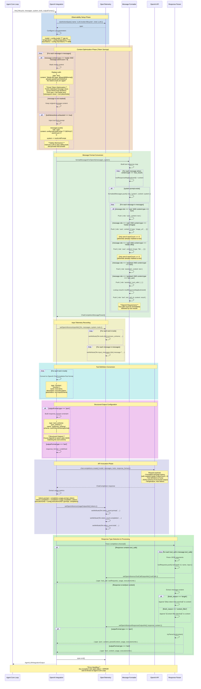

```mermaid
sequenceDiagram
    participant Agent as Agent Core Loop
    participant Integration as OpenAI Integration
    participant Otel as OpenTelemetry
    participant Formatter as Message Formatter
    participant OpenAI as OpenAI API
    participant Parser as Response Parser

    Agent->>Integration: llm({ lifecycle, messages, system, tools, outputFormat })
    
    rect rgb(200, 220, 240)
        Note over Integration,Otel: Observability Setup Phase
        Integration->>Otel: startActiveSpan({ name: 'LLM.invoke<lifecycle>', kind: LLM })
        Otel-->>Integration: span
        
        Integration->>Integration: Configure LLM parameters
        Note over Integration: model = config.model ?? 'gpt-4o'<br/>temperature = config.temperature ?? 0<br/>maxTokens = config.maxTokens ?? 4096
    end
    
    rect rgb(240, 220, 200)
        Note over Integration,Formatter: Context Optimization Phase (Token Savings)
        
        loop For each message in messages
            alt message.content.type === 'media' AND message.seenCount > 0
                Integration->>Integration: Mask media content
                Note over Integration: Replace with:<br/>{<br/>  type: 'text',<br/>  content: "Media file (type: ${type}@${format})<br/>           already parsed and looked at.<br/>           No need to look at it again"<br/>}
                Note over Integration: **Smart Token Optimization:**<br/>Tracks individual message views<br/>across ReAct loop iterations.<br/>First view = full media sent,<br/>Subsequent views = text placeholder
            else message is not masked
                Integration->>Integration: Keep original message content
            end
        end
        
        alt toolInteractions.exhausted === true
            Integration->>Integration: Inject tool limit prompt
            Note over Integration: messages.push({<br/>  role: 'user',<br/>  content: config.toolLimitPrompt ?? DEFAULT,<br/>  seenCount: 0<br/>})<br/><br/>system += toolLimitPrompt
            Note over Integration: **Safety Mechanism:**<br/>Instructs LLM to stop calling tools<br/>and provide final answer
        end
    end
    
    rect rgb(220, 240, 220)
        Note over Integration,Formatter: Message Format Conversion
        
        Integration->>Formatter: formatMessagesForOpenAI(messages, system)
        
        Formatter->>Formatter: Build tool response map
        loop For each message where content.type === 'tool_result'
            Formatter->>Formatter: toolResponseMap[toolUseId] = content
        end
        
        alt system prompt exists
            Formatter->>Formatter: formattedMessages.push({ role: 'system', content: system })
        end
        
        loop For each message in messages
            alt message.role === 'user' AND content.type === 'text'
                Formatter->>Formatter: Push { role: 'user', content: text }
            else message.role === 'user' AND content.type === 'media' (image)
                Formatter->>Formatter: Push { role: 'user', content: [{ type: 'image_url', ... }] }
                Note over Formatter: Only sent if seenCount === 0<br/>(otherwise already masked to text)
            else message.role === 'user' AND content.type === 'media' (file)
                Formatter->>Formatter: Push { role: 'user', content: [{ type: 'file', ... }] }
                Note over Formatter: Only sent if seenCount === 0<br/>(otherwise already masked to text)
            else message.role === 'assistant' AND content.type === 'text'
                Formatter->>Formatter: Push { role: 'assistant', content: text }
            else message.role === 'assistant' AND content.type === 'tool_use'
                Formatter->>Formatter: Push { role: 'assistant', tool_calls: [...] }
                Formatter->>Formatter: Lookup result in toolResponseMap[toolUseId]
                Formatter->>Formatter: Push { role: 'tool', tool_call_id, content: result }
                Note over Formatter: **OpenAI Requirement:**<br/>Tool calls must be immediately<br/>followed by tool results
            end
        end
        
        Formatter-->>Integration: ChatCompletionMessageParam[]
    end
    
    rect rgb(240, 240, 200)
        Note over Integration,Otel: Input Telemetry Recording
        
        Integration->>Otel: setOpenInferenceInputAttr({ llm, messages, system, tools })
        
        loop For each tool in tools
            Otel->>Otel: setAttribute('llm.tools.{idx}.tool.json_schema', ...)
        end
        
        loop For each message in messages
            Otel->>Otel: setAttribute('llm.input_messages.{idx}.message.*', ...)
        end
    end
    
    rect rgb(200, 240, 240)
        Note over Integration,OpenAI: Tool Definition Conversion
        
        loop For each tool in tools
            Integration->>Integration: Convert to OpenAI ChatCompletionTool format
            Note over Integration: {<br/>  type: 'function',<br/>  function: {<br/>    name: tool.name,<br/>    description: tool.description,<br/>    parameters: tool.inputSchema<br/>  }<br/>}
        end
    end
    
    rect rgb(240, 200, 240)
        Note over Integration,OpenAI: Structured Output Configuration
        
        alt outputFormat.type === 'json'
            Integration->>Integration: Build response_format constraint
            Note over Integration: {<br/>  type: 'json_schema',<br/>  json_schema: {<br/>    name: 'response_schema',<br/>    schema: zodToJsonSchema(format)<br/>  }<br/>}
            Note over Integration: **Structured Outputs:**<br/>Forces OpenAI to return valid JSON<br/>matching the Zod schema
        else outputFormat.type === 'text'
            Integration->>Integration: response_format = undefined
        end
    end
    
    rect rgb(220, 220, 240)
        Note over Integration,OpenAI: API Invocation Phase
        
        Integration->>OpenAI: chat.completions.create({ model, messages, tools, response_format })
        Note over OpenAI: Request payload:<br/>- Formatted message history<br/>  (with masked media if seenCount > 0)<br/>- Tool definitions (if any)<br/>- JSON schema (if structured output)<br/>- Temperature, max tokens
        
        OpenAI-->>Integration: ChatCompletion response
        
        Integration->>Integration: Extract usage metrics
        Note over Integration: tokens.prompt = completion.usage.prompt_tokens<br/>tokens.completion = completion.usage.completion_tokens<br/>executionUnits = config.executionunits?.(prompt, completion)
        
        Integration->>Otel: setOpenInferenceUsageOutputAttr({ tokens })
        Otel->>Otel: setAttribute('llm.token_count.prompt', ...)
        Otel->>Otel: setAttribute('llm.token_count.completion', ...)
        Otel->>Otel: setAttribute('llm.token_count.total', ...)
    end
    
    rect rgb(200, 240, 200)
        Note over Integration,Parser: Response Type Detection & Processing
        
        Integration->>Parser: Parse completion.choices[0]
        
        alt Response contains tool_calls
            loop For each tool_call in message.tool_calls
                Parser->>Parser: Parse JSON arguments
                Parser->>Parser: toolRequests.push({ toolUseId: id, name, input })
            end
            
            Parser->>Otel: setOpenInferenceToolCallOutputAttr({ toolCalls })
            
            Parser-->>Integration: { type: 'tool_call', toolRequests, usage, executionUnits }
            
        else Response is text/json content
            Parser->>Parser: Extract message.content
            
            alt finish_reason === 'length'
                Parser->>Parser: Append "[Max token limit reached]" to content
            else finish_reason === 'content_filter'
                Parser->>Parser: Append "[Content filter blocked]" to content
            end
            
            Parser->>Otel: setOpenInferenceResponseOutputAttr({ response: content })
            
            alt outputFormat.type === 'json'
                Parser->>Parser: tryParseJson(content)
                Parser-->>Integration: { type: 'json', content, parsedContent, usage, executionUnits }
            else outputFormat.type === 'text'
                Parser-->>Integration: { type: 'text', content, usage, executionUnits }
            end
        end
    end
    
    Integration->>Otel: span.end()
    Integration-->>Agent: AgentLLMIntegrationOutput

    Note over Agent,Parser: **Error Handling:**<br/>Any exception sets span.status = ERROR<br/>and re-throws to Agent Core Loop
```
