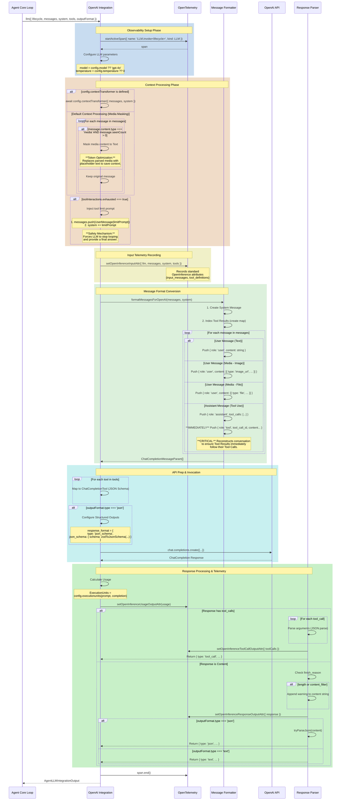

```mermaid
sequenceDiagram
    participant Agent as Agent Core Loop
    participant Integration as OpenAI Integration
    participant Otel as OpenTelemetry
    participant Formatter as Message Formatter
    participant OpenAI as OpenAI API
    participant Parser as Response Parser

    Agent->>Integration: llm({ lifecycle, messages, system, tools, outputFormat })
    
    rect rgb(200, 220, 240)
        Note over Integration,Otel: Observability Setup Phase
        Integration->>Otel: startActiveSpan({ name: 'LLM.invoke<lifecycle>', kind: LLM })
        Otel-->>Integration: span
        
        Integration->>Integration: Configure LLM parameters
        Note over Integration: model = config.model ?? 'gpt-4o'<br/>temperature = config.temperature ?? 0
    end
    
    rect rgb(240, 220, 200)
        Note over Integration,Formatter: Context Processing Phase
        
        alt config.contextTransformer is defined
             Integration->>Integration: await config.contextTransformer({ messages, system })
        else Default Context Processing (Media Masking)
            loop For each message in messages
                alt message.content.type === 'media' AND message.seenCount > 0
                    Integration->>Integration: Mask media content to Text
                    Note over Integration: **Token Optimization:**<br/>Replaces parsed media with<br/>placeholder text to save context.
                else
                    Integration->>Integration: Keep original message
                end
            end
        end
        
        alt toolInteractions.exhausted === true
            Integration->>Integration: Inject tool limit prompt
            Note over Integration: 1. messages.push(UserMessage(limitPrompt))<br/>2. system += limitPrompt
            Note over Integration: **Safety Mechanism:**<br/>Forces LLM to stop looping<br/>and provide a final answer.
        end
    end
    
    rect rgb(240, 240, 200)
        Note over Integration,Otel: Input Telemetry Recording
        
        Integration->>Otel: setOpenInferenceInputAttr({ llm, messages, system, tools })
        Note over Otel: Records standard<br/>OpenInference attributes<br/>(input_messages, tool_definitions)
    end
    
    rect rgb(220, 240, 220)
        Note over Integration,Formatter: Message Format Conversion
        
        Integration->>Formatter: formatMessagesForOpenAI(messages, system)
        
        Formatter->>Formatter: 1. Create System Message
        Formatter->>Formatter: 2. Index Tool Results (create map)
        
        loop For each message in messages
            alt User Message (Text)
                Formatter->>Formatter: Push { role: 'user', content: string }
            else User Message (Media - Image)
                Formatter->>Formatter: Push { role: 'user', content: [{ type: 'image_url', ... }] }
            else User Message (Media - File)
                Formatter->>Formatter: Push { role: 'user', content: [{ type: 'file', ... }] }
            else Assistant Message (Tool Use)
                Formatter->>Formatter: Push { role: 'assistant', tool_calls: [...] }
                Formatter->>Formatter: **IMMEDIATELY** Push { role: 'tool', tool_call_id, content... }
                Note over Formatter: **CRITICAL:** Reconstructs conversation<br/>to ensure Tool Results immediately<br/>follow their Tool Calls.
            end
        end
        
        Formatter-->>Integration: ChatCompletionMessageParam[]
    end

    rect rgb(200, 240, 240)
        Note over Integration,OpenAI: API Prep & Invocation
        
        loop For each tool in tools
            Integration->>Integration: Map to ChatCompletionTool (JSON Schema)
        end

        alt outputFormat.type === 'json'
            Integration->>Integration: Configure Structured Outputs
            Note over Integration: response_format = {<br/>  type: 'json_schema',<br/>  json_schema: { schema: zodToJsonSchema(...) }<br/>}
        end
        
        Integration->>OpenAI: chat.completions.create({...})
        OpenAI-->>Integration: ChatCompletion Response
    end
    
    rect rgb(200, 240, 200)
        Note over Integration,Parser: Response Processing & Telemetry
        
        Integration->>Integration: Calculate Usage
        Note over Integration: ExecutionUnits =<br/>config.executionunits(prompt, completion)
        
        Integration->>Otel: setOpenInferenceUsageOutputAttr(usage)
        
        alt Response has tool_calls
            loop For each tool_call
                Parser->>Parser: Parse arguments (JSON.parse)
            end
            Parser->>Otel: setOpenInferenceToolCallOutputAttr({ toolCalls })
            Parser-->>Integration: Return { type: 'tool_call', ... }
            
        else Response is Content
            Parser->>Parser: Check finish_reason
            alt length or content_filter
                Parser->>Parser: Append warning to content string
            end
            
            Parser->>Otel: setOpenInferenceResponseOutputAttr({ response })
            
            alt outputFormat.type === 'json'
                Parser->>Parser: tryParseJson(content)
                Parser-->>Integration: Return { type: 'json', ... }
            else outputFormat.type === 'text'
                Parser-->>Integration: Return { type: 'text', ... }
            end
        end
    end
    
    Integration->>Otel: span.end()
    Integration-->>Agent: AgentLLMIntegrationOutput
```
