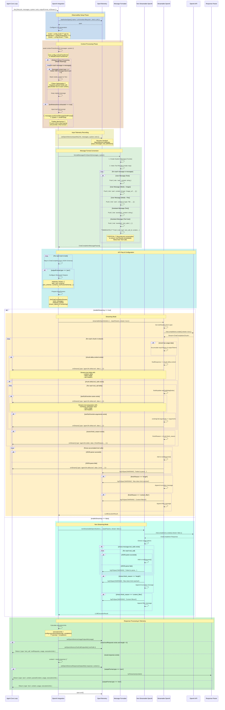

```mermaid
sequenceDiagram
    participant Agent as Agent Core Loop
    participant Integration as OpenAI Integration
    participant Otel as OpenTelemetry
    participant Formatter as Message Formatter
    participant NonStream as Non-Streamable OpenAI
    participant Stream as Streamable OpenAI
    participant OpenAI as OpenAI API
    participant Parser as Response Parser

    Agent->>Integration: llm({ lifecycle, messages, system, tools, outputFormat, onStream })
    
    rect rgb(200, 220, 240)
        Note over Integration,Otel: Observability Setup Phase
        Integration->>Otel: startActiveSpan({ name: 'LLM.invoke<lifecycle>', kind: LLM })
        Otel-->>Integration: span
        
        Integration->>Integration: Configure LLM parameters
        Note over Integration: model = config.model ?? 'gpt-4o'<br/>temperature = config.temperature ?? 0<br/>stream = config.stream ?? false
    end
    
    rect rgb(240, 220, 200)
        Note over Integration,Formatter: Context Processing Phase
        
        Integration->>Integration: await contextTransformer({ messages, system })
        Note over Integration: Uses config.contextTransformer<br/>or defaultContextTransformer
        
        alt Default Context Processing (Media Masking)
            loop For each message in messages
                alt message.content.type === 'media' AND message.seenCount > 0
                    Integration->>Integration: Mask media content to Text
                    Note over Integration: **Token Optimization:**<br/>Replaces parsed media with<br/>placeholder text to save context.
                else
                    Integration->>Integration: Keep original message
                end
            end
        end
        
        alt toolInteractions.exhausted === true
            Integration->>Integration: Inject tool limit prompt
            Note over Integration: 1. messages.push(UserMessage(limitPrompt))<br/>2. system += limitPrompt
            Note over Integration: **Safety Mechanism:**<br/>Forces LLM to stop looping<br/>and provide a final answer.
        end
    end
    
    rect rgb(240, 240, 200)
        Note over Integration,Otel: Input Telemetry Recording
        
        Integration->>Otel: setOpenInferenceInputAttr({ llm, messages, system, tools })
        Note over Otel: Records standard<br/>OpenInference attributes<br/>(input_messages, tool_definitions)
    end
    
    rect rgb(220, 240, 220)
        Note over Integration,Formatter: Message Format Conversion
        
        Integration->>Formatter: formatMessagesForOpenAI(messages, system)
        
        Formatter->>Formatter: 1. Create System Message (if exists)
        Formatter->>Formatter: 2. Index Tool Results (create map)
        
        loop For each message in messages
            alt User Message (Text)
                Formatter->>Formatter: Push { role: 'user', content: string }
            else User Message (Media - Image)
                Formatter->>Formatter: Push { role: 'user', content: [{ type: 'image_url', ... }] }
            else User Message (Media - File)
                Formatter->>Formatter: Push { role: 'user', content: [{ type: 'file', ... }] }
            else Assistant Message (Text)
                Formatter->>Formatter: Push { role: 'assistant', content: string }
            else Assistant Message (Tool Use)
                Formatter->>Formatter: Push { role: 'assistant', tool_calls: [...] }
                Formatter->>Formatter: **IMMEDIATELY** Push { role: 'tool', tool_call_id, content... }
                Note over Formatter: **CRITICAL:** Reconstructs conversation<br/>to ensure Tool Results immediately<br/>follow their Tool Calls.
            end
        end
        
        Formatter-->>Integration: ChatCompletionMessageParam[]
    end

    rect rgb(200, 240, 240)
        Note over Integration,OpenAI: API Prep & Configuration
        
        loop For each tool in tools
            Integration->>Integration: Map to ChatCompletionTool (JSON Schema)
        end

        alt outputFormat.type === 'json'
            Integration->>Integration: Configure Structured Outputs
            Note over Integration: response_format = {<br/>  type: 'json_schema',<br/>  json_schema: { schema: zodToJsonSchema(...) }<br/>}
        end
        
        Integration->>Integration: Prepare baseParams
        Note over Integration: {<br/>  ...llmChatCompletionParams,<br/>  tools, messages,<br/>  response_format,<br/>  stream_options (if streaming)<br/>}
    end
    
    alt enableStreaming === true
        rect rgb(255, 240, 200)
            Note over Integration,Stream: Streaming Mode
            
            Integration->>Stream: streamableOpenAI(client, { ...baseParams, stream: true })
            Stream->>Stream: Get otelHeaders from span
            Stream->>OpenAI: chat.completions.create({ stream: true })
            OpenAI-->>Stream: Stream<ChatCompletionChunk>
            
            loop For each chunk in stream
                alt chunk has usage data
                    Stream->>Stream: Accumulate inputTokens & outputTokens
                end
                
                alt chunk.delta.content exists
                    Stream->>Stream: finalResponse += chunk.delta.content
                    Stream->>Agent: onStream({ type: 'agent.llm.delta.text', data: {...} })
                    Note over Stream,Agent: Streams text delta with:<br/>- content, delta<br/>- token usage<br/>- otel headers
                end
                
                alt chunk.delta.tool_calls exists
                    loop For each tool_call delta
                        Stream->>Stream: Build/update toolCallsMap[index]
                        alt toolCall.function.name exists
                            Stream->>Agent: onStream({ type: 'agent.llm.delta.tool', data: {...} })
                            Note over Stream,Agent: Streams tool preparation with:<br/>- toolname, toolUseId, input<br/>- token usage<br/>- otel headers
                        end
                        alt toolCall.function.arguments exists
                            Stream->>Stream: existingCall.arguments += arguments
                            Stream->>Agent: onStream({ type: 'agent.llm.delta.tool', data: {...} })
                        end
                    end
                end
                
                alt chunk.finish_reason exists
                    Stream->>Stream: finishReason = chunk.finish_reason
                    Stream->>Agent: onStream({ type: 'agent.llm.delta', data: { finishReason, ... } })
                end
            end
            
            loop Parse accumulated tool calls
                alt JSON.parse succeeds
                    Stream->>Stream: Add to toolRequests[]
                else JSON.parse fails
                    Stream->>Agent: onStream({ type: 'agent.llm.delta.tool', data: { error, ... } })
                    Stream->>Otel: logToSpan('WARNING', 'Failed to parse...')
                end
            end
            
            alt finishReason === 'length'
                Stream->>Otel: logToSpan('WARNING', 'Max token limit reached')
                Stream->>Stream: Append truncation message
            end
            
            alt finishReason === 'content_filter'
                Stream->>Otel: logToSpan('WARNING', 'Content filtered')
                Stream->>Stream: Append filter message
            end
            
            Stream-->>Integration: LLMExecutionResult
        end
    else enableStreaming === false
        rect rgb(200, 255, 240)
            Note over Integration,NonStream: Non-Streaming Mode
            
            Integration->>NonStream: nonStreamableOpenAI(client, { ...baseParams, stream: false })
            NonStream->>OpenAI: chat.completions.create({ stream: false })
            OpenAI-->>NonStream: ChatCompletion Response
            
            NonStream->>NonStream: Extract usage tokens
            
            alt choice.message.tool_calls exists
                loop For each tool_call
                    alt JSON.parse succeeds
                        NonStream->>NonStream: Add to toolRequests[]
                    else JSON.parse fails
                        NonStream->>Otel: logToSpan('WARNING', 'Failed to parse...')
                    end
                end
            end
            
            alt choice.finish_reason === 'length'
                NonStream->>Otel: logToSpan('WARNING', 'Max token limit reached')
                NonStream->>NonStream: Append truncation message
            end
            
            alt choice.finish_reason === 'content_filter'
                NonStream->>Otel: logToSpan('WARNING', 'Content filtered')
                NonStream->>NonStream: Append filter message
            end
            
            NonStream-->>Integration: LLMExecutionResult
        end
    end
    
    rect rgb(200, 240, 200)
        Note over Integration,Parser: Response Processing & Telemetry
        
        Integration->>Integration: Calculate executionUnits
        Note over Integration: executionUnits =<br/>config.executionunits(prompt, completion)<br/>?? (prompt + completion)
        
        Integration->>Otel: setOpenInferenceUsageOutputAttr(usage)
        
        alt result.toolRequests exists and length > 0
            Integration->>Otel: setOpenInferenceToolCallOutputAttr({ toolCalls })
            Integration-->>Agent: Return { type: 'tool_call', toolRequests, usage, executionUnits }
            
        else result.response exists
            Integration->>Integration: content = result.response || ''
            Integration->>Otel: setOpenInferenceResponseOutputAttr({ response: content })
            
            alt outputFormat.type === 'json'
                Integration->>Parser: tryParseJson(content)
                Integration-->>Agent: Return { type: 'json', content, parsedContent, usage, executionUnits }
            else outputFormat.type === 'text'
                Integration-->>Agent: Return { type: 'text', content, usage, executionUnits }
            end
        end
    end
    
    Integration->>Otel: span.end()
```
